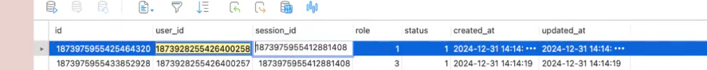
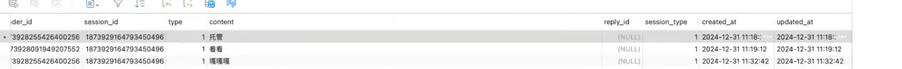
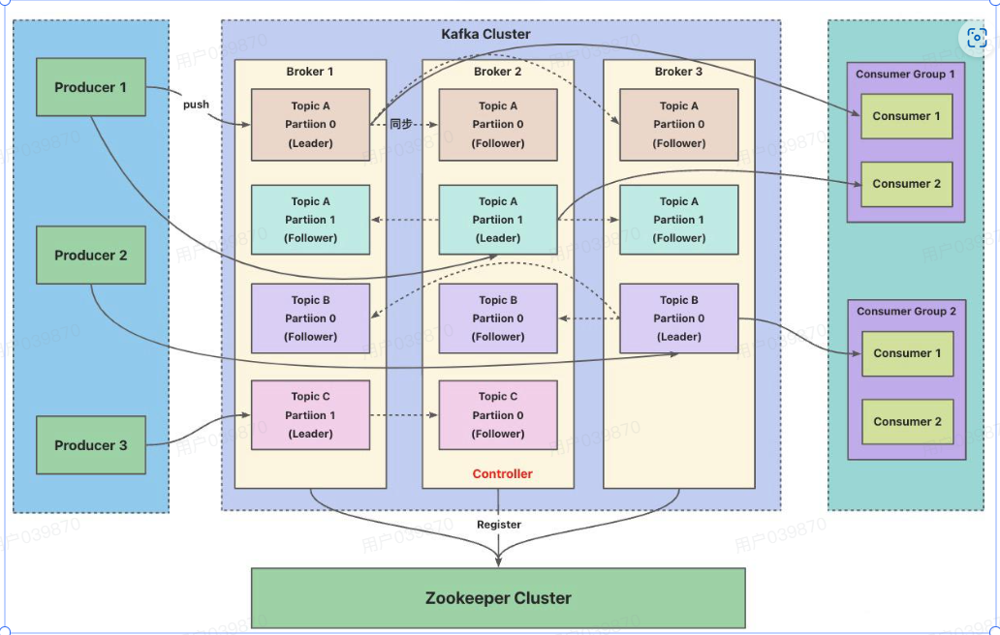
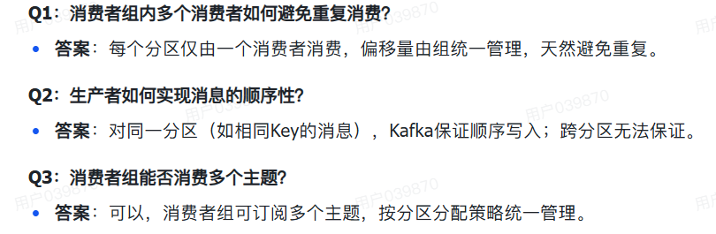
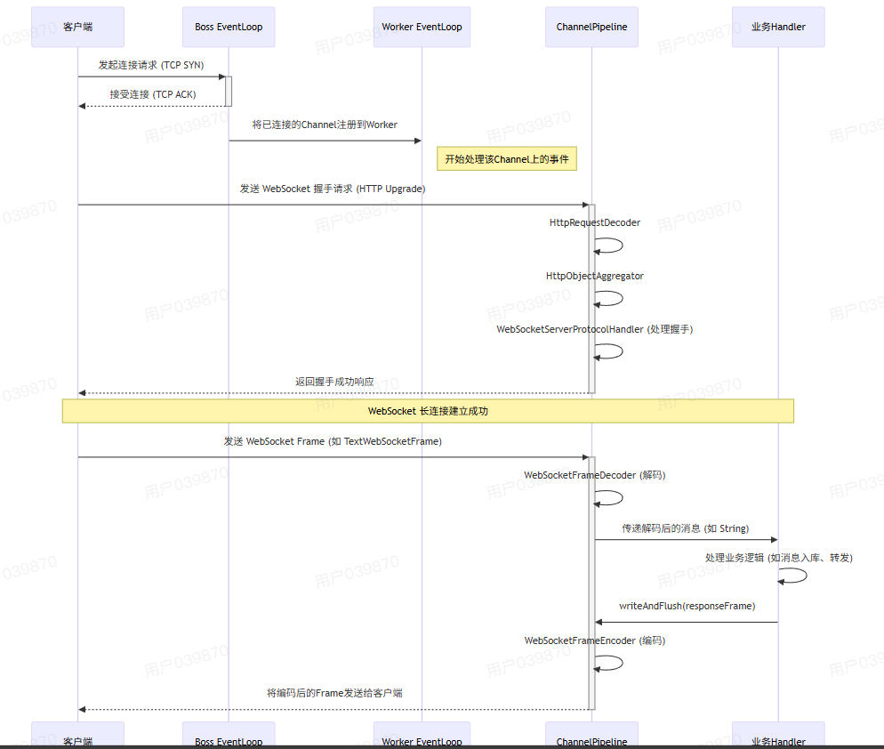

# IM-QiNIAN

### 一、注册登录模块

1.数据库设计

User表的设计：用户ID，用户名，密码，邮箱，电话，头像，签名，性别，用户状态，创建时间，更新时间

2.Minio设计思路

### 2.消息模块

1.主要是各个表的设计

请求消息：发送者ID，接收者ID，会话ID，会话类型，消息体。

接收消息：同上，发送者ID替换为创造时间。

消息：       会话ID，会话类型，发送者头像，发送者ID，发送者姓名，接受者ID，消息类型，会话名称，会话头像，创造时间，消息体。

### 3 .离线消息存储模块

1.各个表的设计：

session表：

分别代表：会话ID，会话名称，消息类型，会话状态，创建时间，更新时间

user-session：

代表：sessionID信息，用户Id,会话Id,用户角色，状态，创建时间，更新时间

message表：

代表：发送者ID，会话ID，消息类型，消息内容，回送消息的ID，会话类型，创造时间，更新时间

红包表：

分别代表：红包ID，发送者ID，会话ID，红包文本信息，红包类型，总金额，总数量，剩余金额，剩余数量，红包状态，创建时间

2.离线消息设计方案

消息总数，消息会话ID，会话名称，会话头像信息，会话类型，消息具体细节：头像，消息类型，用户名，发送者ID，消息ID，消息体：

消息内容，创建时间，恢复ID信息。

### 1.请你说一下心跳检测具体怎么实现的

答：心跳检测使用了netty服务自带的idlestateHandeler,用于监控连接的读空闲，写空闲，读写空闲。本项目使用的是读空闲，其具体实现细节是当达到一定时间没有接收到数据时，就是服务端向客户端发送一个心跳包，用于检测客户端是否在线。

### 2.简要说明一下雪花算法的底层实现

答：雪花算法能够保证唯一性，单调递增，含时间戳，高可用低延迟。长度为64位，分别是符号位，时间戳，机房位，机器位和序列号。

### 3.一致性哈希的底层实现

答：如果采用简单的哈希算法，当netty实例数量发生变化时，会导致几乎所有用户的绑定关系都需要重新计算。

一致性哈希将每个对象映射到圆环边上的一个点，系统可再次将节点机器映射到圆环的不同位置。

该项目的具体实现：首先构建一个哈希环，然后将每个netty服务器的ip地址映射到哈希环上，然后当有用户登录的时候，我们会将userid进行同样的哈希，也得到一个点，然后进行顺时针，找到第一个节点就是该用户的服务器；

具体流程：哈希环的构建，虚拟节点的引入，

### 4.简要概述一下websocket协议

答：websocket协议是一种应用层协议，用于在web应用中创建实时，双向的通信通道。传统的http协议是请求响应模式的，而websocket可以建立一个长久连接，允许服务端向客户端发送数据，还允许客户端向服务器端发送消息。websocket协议建立在http协议之上，所有的 WebSocket 请求都会通过普通的 HTTP 协议发送出去，然后在服务器端根据 HTTP 协议识别特定的头信息 Upgrade，服务端也会判断请求信息中 Upgrade 是否存在。 

### 5.你是怎么通过kafka顺序消费保证消息的有序传递

答：kafka只能保证在一个分区内消息的顺序，而无法保证分区的顺序性。所以我们要保证顺序性需要生产者通过指定消息键（key）将相关消息发送到同一分区，消费者则按分区消费。

### 6.简要说明一下假如客户A与客户B发送消息是怎么通信的

答：1.首先判断是群发还是单发，是不是与用户B为朋友关系，客户A构建消息体；

​	2.将消息发送到消息服务模块，根据kafka存储到数据库中；

​	3.通过Redis找到接受者Netty服务所在的地址；

​	4.通过http发送到接受者所在的netty服务；

​	5.判断消息类型，将消息发送到对应的管道中

### 7.说一下群聊到底怎么实现的

答：

1. 客户端 A 构建消息对象(包含会话 ID、内容、时间戳等)
2. 消息通过 Kafka 保存到数据库中
3. 通过 Nacos 找到所有的 Netty 服务地址
4. 遍历发送消息给所有的服务
5. 通过会话 ID 找到所有群成员的 Channel 地址
6. 通过 WebSocket 进行广播发送消息(写扩散)

### 8.说一下KAFKA架构

答：主要包含以下几个组成部分

​	生产者：生产消息体

​	消费者：消费消息体，消费者组

​	broker:经纪人 一台 Kafka 服务器就是一个 broker。一个集群由多个 broker 组成。一个 broker可以容纳多个 topic。

​	partition:每个 partition 是一个有序的队列；如果一个topic中的partition有5个，那么topic的并发度为5.一个分区只能被一个消费者吃；

​	topic:话题，可以理解为一个队列， 生产者和消费者面向的都是一个 topic；

### 9.消息的ACK机制是如何实现的

答：在客户A向客户B发送消息的时候，首先会将消息发送到KAFKA中间件中，使用KAFKA的send方法，并且设置acks=all，消息投递采用同步的方式，生产者要要保证消息投递到服务端，并且投递成功的响应，确认服务器接受才能继续往下执行；

​	消费者在接受到消息后，采用的是手动提交，返回会话ID，接收者ID的信息。如果消费失败的话我们会不断的进行重试；

### 10.如何确保消息的幂等性的呢？

答：`enable.idempotence=true` 是 Kafka 生产者配置中的一个重要参数，主要用于启用生产者的 **幂等性（Idempotence）** 功能。确保生产者在发送消息时，即使发生了重试，也不会重复发送相同的消息，从而保证消息的 **唯一性** 和 **不重复性**。

​	消费者幂等性设计。使用redis记录已被处理的消息，设置过期时间。在处理消息前利用 redis 检查这个消息是否已经被处理。（高并发下消息去重）

### 11.你的分区策略是什么？当消费者组扩容时如何避免消息乱序？

答：我根据代码看的是根据用户ID采用不同分区，topic都是采用一样的，一个用户的消息都放到了同一个分区下，我有一个疑问就是，但是这样的话假如A向B,C都发送消息，B，C怎么从kafka拉去消息的时候不就乱了吗？

### 12.**当消费者组扩容时如何避免消息乱序？**

答：扩容时，Kafka会重新平衡分区分配，但每个分区仍只会被一个消费者消费；

### 13.请你说一下红包包括类的设计，分布式事务方案具体是什么？

答：类的设计：红包消息请求：发送者id，会话信息，接受者ID，会话类型；红包消息体（总金额，总数量，红包类型，红包祝福语）；

​			 返回消息体：会话ID，会话类型，消息ID，消息创造时间，消息体；

​			红包消息体：红包ID，发送者ID，会话ID，红包封面文案，红包总金额，红包总数量，红包类型，红包剩余金额，红包剩余数量，红包状态（未领取，已领取完，已过期），创建时间；

​			红包日志状态:

​	分布式事务主要就是使用分布式锁KEY采用的是红包ID，value值存放的是剩余红包个数；

### 14.身份认证模块的token是怎么产生的，又是怎么传递的？

答：我在某网站上进行登录会产生token，当我访问网站不是登录界面时，需要校验我的登录信息，难道我之前产生的token都会在http头信息上，然后从上面提取用户信息，检验是否登录；

### 15.**如果现在要求你把这个系统扩展到支持100万同时在线用户，你会在现有架构上做哪些改进？**

答：1.负载均衡策略，确保请求均匀分配到不同的服务器上；增加服务节点；

​	2.数据库分库分表，并且采用主从复制技术，减少主数据库的压力；	

​	3.使用微服务架构，将系统从单体架构（Monolithic）拆分成多个微服务（Microservices）；

​	4.消息队列和异步请求；

### 16.实体设计

答：用户：ID  NAME 密码  邮箱  手机号 头像 个性签名  性别  状态 更新时间  创建时间 

​	用户存储金额表： 用户ID   存款  更新时间

​	消息表 ：UUID  发送者ID   会话ID  类型（消息类型）  会话类型  消息内容   创建时间  

​	会话表：ID   名称  类别（单聊，群聊） 状态（正常，删除）  创建时间  修改时间；

​	会话关系表：ID  用户ID  会话ID   角色（群主，管理员，普通用户）  状态   创建时间  修改时间

​	好友关系表：ID  用户ID  好友ID  好友状态  创建时间   修改时间；

​	好友申请表：ID   用户ID  目标用户ID  申请信息  状态  创建时间  修改时间

​	红包设计：ID  发送者用户ID  会话ID  封面文案信息  红包类型（普通红包，拼手气红包）红包总金额  红包总个数 剩余金额 剩余个数    

​	状态（未领取完，已领取完，已过期） 创建时间；

​	红包领取记录表： ID  红包ID  用户ID  领取金额  领取时间

​	余额变动记录表：ID  用户ID  变动金额  变动类型（领取红包，红包退款，其他） 关联ID  创建时间

​	朋友圈表：朋友圈ID  用户ID 朋友圈文本内容 朋友圈媒体  创建时间 更新时间 逻辑删除时间，点赞列表；

​	评论表信息：评论ID  朋友圈ID 用户ID  父评论ID  回复ID  评论内容 创建时间 更新时间 逻辑删除 ；

​	离线消息实体设计：会话总数  会话ID  会话名字  会话头像  会话类型 消息细节（头像，离线消息体（内容 创建时间 回复ID）消息类型  用户名 发送者ID  消息ID）

### 17.平常所说的跨域怎么理解

答：主要是判断两个是不是同源包括（协议，地址，端口）；

### 18.说一下长链接模块

答：主要目的就是构造用户ID与netty服务的映射）；用一个redis存储  keykeyprefix + userid  ; value : 服务器地址；

​	还有就是channel与userID的映射关系；

​	同时维护一个心跳检测；身份验证；并将netty服务注册到nacos中；

​	netty服务有两个重要的点就是1.netty所有IO操作都是异步的；2.一个是BOSS（主要用于连接）一个是worker（主要用于处理连接之后一些请求）；

### 19.发送红包流程

答：1.检查发送者余额信息；

​	2.创建红包记录

​	3.记录余额变更日志

​	4.发送红包消息（设置红包剩余个数到redis中）

​	5.抢红包（首先判断红包是否有效，是否已经抢过红包，红包余额（统一经过lua脚本实现））

### 20.创建一个聊天的流程

答：1.确认创建者状态是否正常

​	2.生成SeddionID，创建群聊消息体对象

​	3.创建一个会话

​	4.创建用户与会话的映射消息表；（邀请只能邀请朋友）

​	5.通知给除了创建者的所有人；

### 21.kafka的架构

答：

### 22.kafka的生产者组和消费者组是什么？有什么机制

答：消费者组由多个消费者构成，共同订阅一个或多个主题的消息；

​	核心：实现消息的并行消费和负载均衡，确保高吞吐量和容错性；

​	关键机制：分区分配    重平衡   偏移量管理

​	

### 23.KAFKA是如何保证消息的顺序消费的

答:kafka只能保证单个分区内消息的顺序消费，而无法保证不同分区消息的顺序消费，所以我们可以制定key将消息发送到一个分区；又因为采用的是分配机制确保了每个分区只能被一个用户所消费，从而保证消息的有序性；

### 24.Rabbitmq与kafka的区别，不同的适用场景选择

答：

RabbitMQ : 可靠传递消息，支持复杂路由比如direct  路由模式  同时支持延迟队列，优先级队列信息；对消息的可靠性，顺序性事务性又极高的要求；

kafka：设计初衷主要是高吞吐量，持久化日志，流式处理消息；主要用于消息量大，吞吐量高；且消费及时性要求高的数据；

### 25.kafka为什么那么快

答：顺序写文件，kafka将消息顺序写到日志文件中，不是随机写磁盘，顺序写磁盘比随机写磁盘速度快的多；

​	采用了零拷贝技术：kafka使用sendfile（）系统调用，直接把文件内容，从磁盘缓存到网络缓冲区，避免在用户态与内核态之间拷贝数据

​	批量处理：kafka producer 会把多条消息批量发送，减少网络请求次数

### 26.WebSocket与Http协议的区别

答：http是一个基于请求和响应模式的协议，最早用于web应用；

​	websocket是一个双向协议，可以在服务端与客户端建立持久连接，以实现实时通信；

​	http协议通常用于一问一答，websocket协议是对话的模式

### 27.websocket如何保证消息的可靠性

答：1.消息确认机制；

​	2.消息序列号；

​	3.幂等性保证

​	4.心跳机制

​	5.重连后消息同步；

### 28.KAFKA中的HW，LEO，LSO，LW分别代表什么

答：HW ： 高水位线，可以安全消费的最大offset

​	LEO:    日志末端，写入的最后一条消息的下一个 offset

​	LSO：某个 partition **日志最早的有效消息 offset**

​	LW ：最近 **写入 broker 的消息 offset**

### 29.针对人数较多的群怎么发送消息的

答：读扩散：服务器只把消息存一份，客户端上线后，主动去拉取自己所在群的消息；

​	写扩散：服务器主动推送给每个人，实时性好，适合小群；

### 30.为什么选择websocket和netty作为主要的技术栈

答：websocket扮演的是应用层的角色，它解决了我们该怎么说，说什么的问题；netty扮演的是网络基础架构的角色，解决了如何高效稳定地建立连接和传输数据；

​	Netty为WebSocket提供了坚实的性能底座；Netty的pipeline机制让处理websocket协议变得极其简单；netty内置了WebSocketServerProtocolHandler,它能自动处理WebSocket 的HTTP升级握手，心跳，数据帧的编解码等繁琐工作；开发者只需要关注真正的业务逻辑即可；

### 31.Reids缓存突然挂掉了方案

答：预防：构建高可用Redis架构：主从复制备份，哨兵模式，集群分片

​	事件恢复与影响控制：快速失败与服务降级；客户端熔断；实时监控与警告

### 32.kafka为什么那么快

答：1.kafka采用了顺序读写的方式

​	2.kafka使用了零拷贝技术，主要变现为（一般程序流程为：磁盘文件-》内核文件-》用户缓存区-》内核缓冲区-》网卡）

​							kafka变为了（磁盘文件-》内核缓冲区-》网卡）

​	3.严格依赖操作系统的页缓存来存储数据，而不是在jvm堆内存中缓存；

### 33.webcoket的缺点

答：websocket连接是有状态的，所以每个活跃的用户都会在服务器上维持一个连接对象；

### 34.我想问的问题就是当A像B发送消息的时候，中间不同服务器实是怎么找到的

答：首先是服务发现功能：通过NACOS监听长连接的服务列表，并监听其变化，然后根据服务列表构建出一个哈希环；

​	当用户进行登录的时候，用户达到认证模块，使用userid在一致性哈希算法上计算出目标netty的服务地址；

​	针对具体（nacos是怎么实现的呢）主要利用nacos的服务发现机制吧，当一个netty服务上来的时候，我就会收集实例的信息，比如服务名，IP地址，端口号，集群名等信息

### 35.简要介绍一下Netty中的IdleHandler

答：idlehandler主要用于检查当前连接是否空闲，有三种模式读空闲，写空闲，读写空闲；当我达到对应的条件就会触发某种事件对吧；Eventloop  IdleStateEvent;

### 36.分布式ID生成之后，再用base编码要求生成的id的长度进行确定

### 37.rabbitmq持久化失败怎么办

答：通常包含三个部分：交换机持久化，队列持久化，消息持久化

​	检查硬件资源是不是充足。;

​	kafka持久化就是采用了顺序写的 方式，同时实现了零拷贝技术；

### 38.Nacos注册的都是什么信息

答：IP地址 端口

### 39.Netty处理业务的流程信息

答：

### 40.Netty处理流程

答：1.先试用bossgroup建立一个客户端连接，创建对应的niosocketchannel

​	2.将niosocketchannel注册到workergroup中的一个eventgroup中

​	3.该eventgroup负责处理IO事件

​	4.当有数据可读时，eventloop会触发channelpipline中的一些列channelInbounder;

### 41.映射关系为什么使用concurrenthashmap

答：workergroup有多个eventloop，新的连接会以轮询的方式分配给其中一个eventloop,不同的channel很可能分配到不同的eventgroup上，这意味着你的userchannelmannger可能分配到不同的eventloop上；

​	

​	
