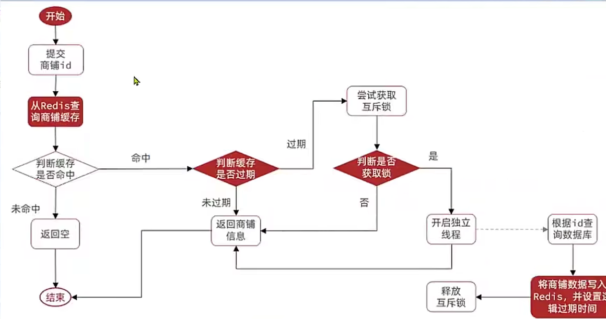
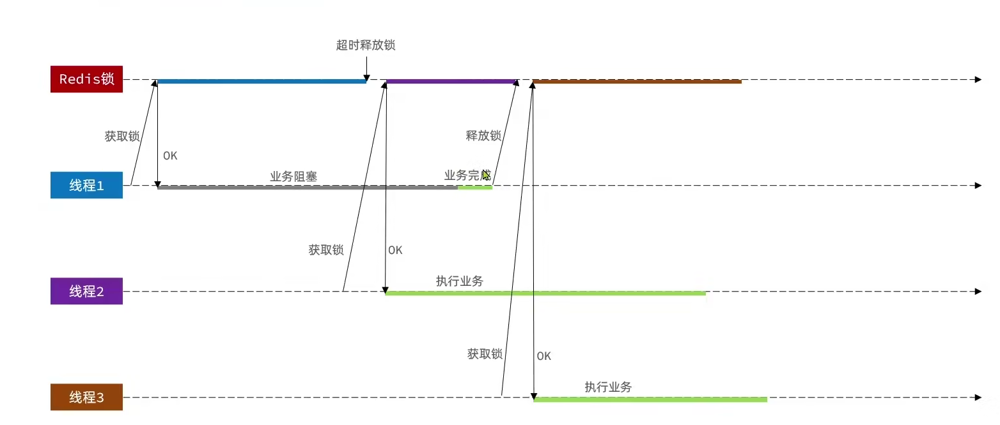
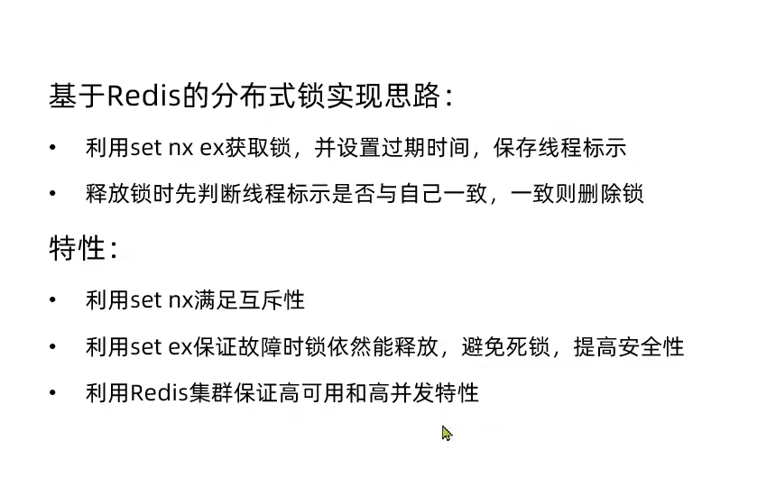
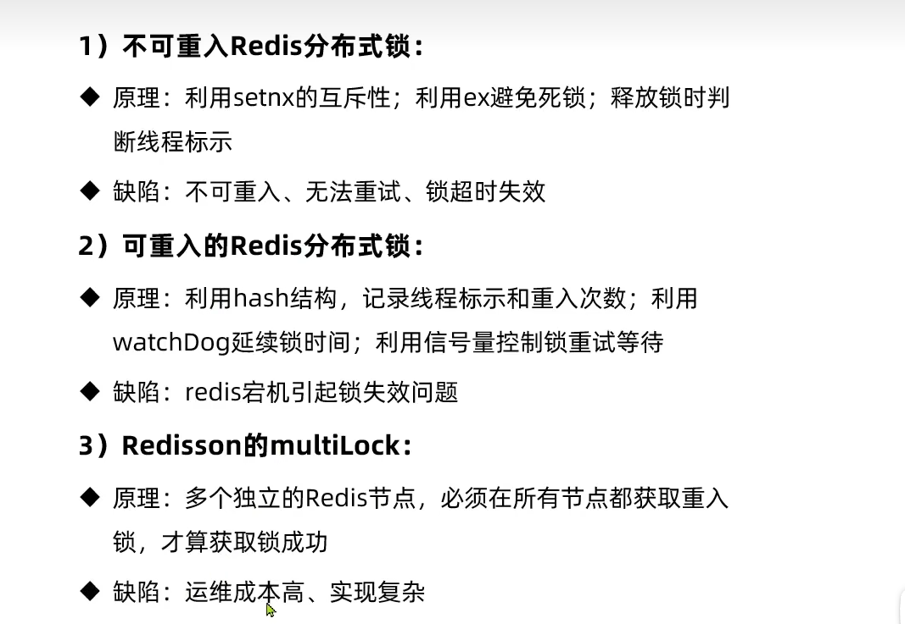
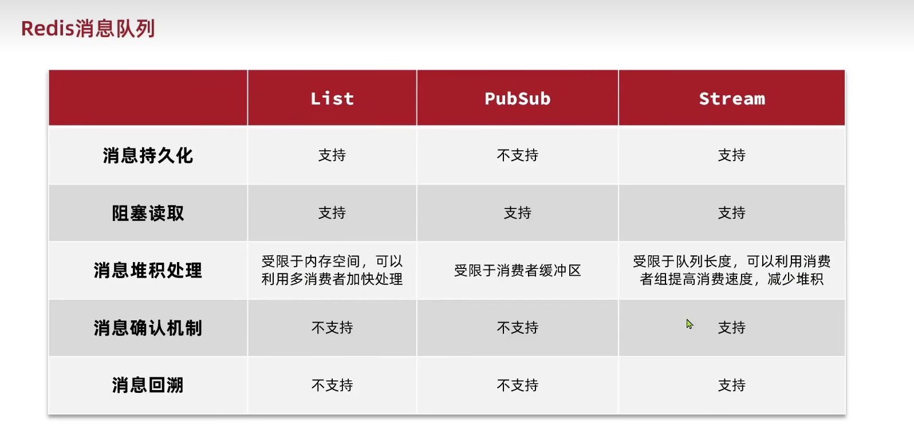
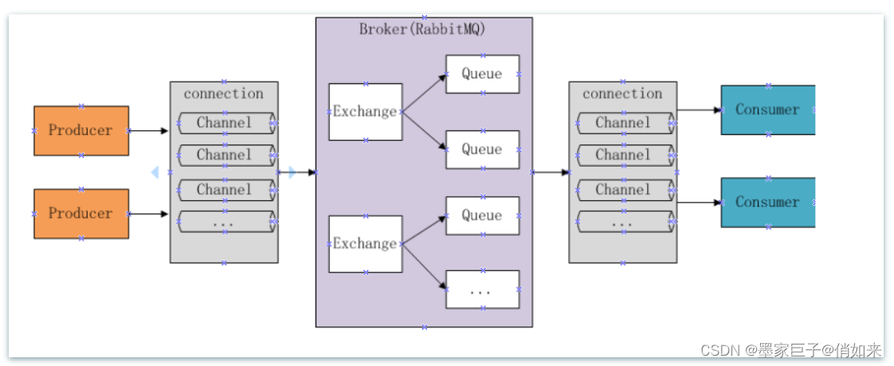
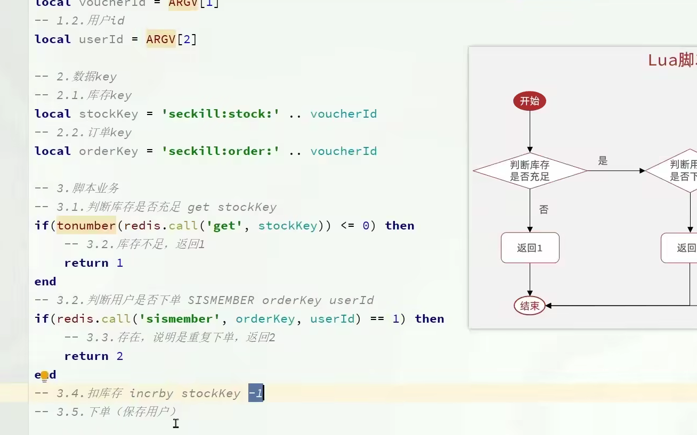
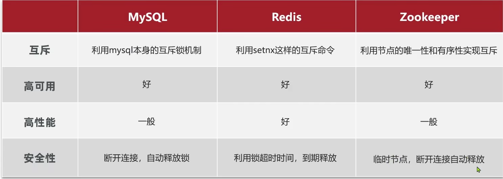

## 黑马点评技术栈常见问题

### 1.拦截器功能

  a.创建一个拦截器类

  b.创建一个拦截器配置类，将拦截器放入到配置里面。  

特点：设置了两个拦截器，第一个拦截器的作用是获取用户token，并将用户信息放到thread local中，不管访问任何界面都会刷新redis的过期时间，也会放行所有事件，第二个拦截器的作用就是防止没有登录的用户访问信息。

继承自HandlerInterceptor;

### 2.Session为什么不行

  多台Tomcat并不共享session存储空间，当请求切换到不同tomcat服务时导致数据丢失的问题。

### 3.商家种类设计场景

  采用Hash表存储各个种类信息，Map<Object,Object>,第一个参数为商品种类的id，第二个参数主要保存各个商品种类的信息。

```
// 如果Redis缓存中存在数据，反序列化为List<ShopType>
for (Object value : redisCache.values()) {
    String json = (String) value;
    ShopType shopType = JSONUtil.toBean(json, ShopType.class);
    typeList.add(shopType);
}
```

### 4.为什么每次更新的时候选择删除缓存而不是更新缓存

   a.两个请求并发更新同一条数据的时候，可能会出现缓存和数据库中的数据不一致的现象。

   b.不是所有缓存数据都是频繁访问的，更新后的缓存可能长时间不被访问，所以说，从计算资源和整体性能相对考虑，更新的时候删除胡村可以避免一定资源的浪费。  

 ### 5.缓存穿透是如何解决的

a.缓存空对象

​	就是每次查找都为空的时候返回一个空对象，并设置过期时间，并放在redis里面。

b.布隆过滤

​	布隆过滤就是在redis与客户端中间加一个过滤器， 里面存放的是二进制位，通过一定的算法将键值生成的二进制位存放在过滤器中，其中如果不存在的话，一定不存在，检测出存在也有可能存在，所以不可能百分之百准确。

### 6.Redis如何实现互斥锁

a.初级互斥锁

String对象中有一个setNx,就是每次建立的时候只能出现一个setNx,并设置有效期，防止服务故障，一直拿着锁，释放锁的时候直接删除锁就可以了

### 7.解决缓存击穿问题

a.每次访问数据库的时候都必须获取锁，保证每次只能有一个人能访问数据库。

b.设置逻辑过期时间，就是每次都为一个东西设置一个字段就是逻辑过期时间，每次访问的时候检查是否达到过期时间，未过期直接返回信息，过期的话。判断是否获取互斥锁，如果未获取，则先返回旧数据，获取的话开启独立线程，根据id查询数据库，将商铺数据写入redis并设置逻辑过期时间，释放互斥锁返回商铺信息。



### 8.全局ID生成器

  原因：自增长可能会使用户获取一些信息，而且当数据量非常大时，就会创建一个新的表，由于每个表都是重新开始计算自增长的，所以会出问题。

  特性：唯一性，高可用，高性能，递增性，安全性

  策略：1.UUID 2.Redis自增 3.雪花算法 4.数据库自增

  附：雪花算法：利用分布式架构中的数据中心ID、机器ID，时间戳等来生成的。

  ### 9.优惠券超卖问题

  悲观锁：添加同步锁，让线程同步执行。

  乐观锁：1.版本号法  2.CAS方法 

  CAS的缺点：a.ABA问题  b.循环时间长开销大 c.只能保证一个共享变量的源自操作。

  乐观锁的问题：成功率太低。可以的

  附：CAS的底层实现原理。

​	在黑马点评中就是在下单之前先检查库存的含量是否为0；如果大于0则进行扣减；同时使用lua脚本保证扣减的原子性；

### 10.一人一单问题

a.添加同步锁，例如：synchronized,但是这种只能解决单机模式下的情况（原因：JVM监视器）

  synchronized关键字的使用方式主要有下面3种：

  1.修饰实例方法：会给当前对象实例加锁，锁的是当前对象实例。

  2.修饰静态方法 ： 会给当前类加锁，会作用于类的所有对象实例，进入同步代码前需要获得当前class的锁。

   3.修饰代码块：对括号里制定的对象、类加锁。

​    附：synchronized的底层原理；

b.基于Redis的分布式锁

  要点：阻塞锁还是非阻塞锁，Redis键值的设定。 

```
private static final String KEY_PREFIX = "lock:";
private static final String ID_PREFIX = UUID.randomUUID().toString(true)+"-";
//保证redis的唯一性
KEY : KEY_PREFIX+name
Value:  ID_PREFIX  + threadId  
Expire:timeoutSec, TimeUnit.SECONDS
   以此来区分不同jvm和不同ID
```

  可能存在的问题：

​    1.所以释放锁的时候需要判断锁是不是自己家的，避免删除别人的锁，造成多线程并行问题。

2. 判断锁标识和释放锁是两个动作，所以我们需要保证其中的原子性。Redid的Lua脚本。

   总结：

    ### 11.基于Redis的分布式锁优化

     基于SetNx实现的分布式锁可能出现以下问题

    1.不可重入 2.不可重试 3.超时释放 4.主从一致性(连锁进行解决)
   
     
   
     异步秒杀思路
   
     1.执行LUA脚本，先判断用户是不是具有秒杀资格，主要包括用户是否下单，是否还有库存。
   
     2.创建订单信息，并将订单信息放入到阻塞队列中去。其中由于是异步操作，所以需要开启独立线程，创建线程池。
   
   ```
   private static final ExecutorService EXECUTORSERVICE = Executors.newFixedThreadPool(10);
   
   @PostConstruct
   private void init(){
       EXECUTORSERVICE.submit(new VoucherOrderTask());
   }
   
   private class VoucherOrderTask implements Runnable {
       @Override
       public void run() {
           while(true){
               try{
                   //获取订单中的订单信息
                   VoucherOrder voucherOrder = orderTasks.take();
                   //创建订单
                   handleVoucher(voucherOrder);
               } catch (Exception e) {
                   log.info("处理订单业务出现异常");
   
               }
           }
       }
   ```
   
     3.从队列中读取订单信息，开始数据库操作。
   
    ### 12.Redis消息队列
   
     List消息队列，优点：利用Redis存储，基于Redis有持久化机制，保证有序性。无法避免消息丢失。
   
     PubSub消息队列：采用发布订阅模型，支持多线程，多消费。不支持数据持久化，无法避免消息丢失。
   
     Stream消息队列：消息可回溯，一个消息可以被多个消费者读取，可以阻塞读取。
   
   
   
    ### 13.Feed流
   
   1.拉模式   只有读消息的时候才会拉取信息。
   
   2.推模式  就是将一个人的消息主动推送给所有粉丝。
   
   3.推拉模式 根据不同用户选择使用拉模式还是推模式
   
    ### 14.排行榜为什么使用SortSet而不是使用List
   
   因为我们要使用滚动查询，而且内容是一直更新的，所以我们要使用时间戳对各个键值进行排序，而且还要记录上页的最后一个信息，所以可以使用时间戳进行记录，总的来说使用SortSet类型更加好。
   
   问题：其中的滚动页查询是怎么设计的？
   
   1.要传入四个参数，分别是最小值，上次读到的最后一条信息的时间戳，偏移量（就是最后一个值有几个，然后下次直接跳过的数量），读取的数量。
   
   ### 15.三种特殊的Redis结构
   
   BitMap:非常适合二值状态统计的场景，这里的二值状态就是指集合元素的取值只有0和1两种，在记录海量数据时，Bitmap能够有效地节省内存空间。
   
   HyperLog:用于统计基数的数据集合类型，基数统计就是指统计一个集合中不重复的元素个数，但是需要需要注意到是统计规则是基于概率完成的，所以有一定的误差。
   
   GEO：使用了Sorted Set集合模型，GEO类型使用GeoHash编码方法实现了经纬度到Sorted Set中权重分数的转换，这其中两个关键机制就是对二维地图做区间划分和对区间进行编码。
   
   ### 16.什么是缓存雪崩，击穿，穿透
   
   缓存雪崩： 1.大量缓存数据同时过期，redis故障     解决方案：给不同的key添加不同的过期时间；缓存数据悠久不过期；给缓存业务添加降级限流等策略；给业务添加多级缓存；
   
   缓存击穿： 热点数据缓存过期
   
   缓存穿透 ： 数据既不在缓存也不在数据库。
   
   ### 17.常见的缓存更新策略
   
   1.Cache Aside策略：写策略步骤先更新数据库再删除缓存，为什么这样做呢？
   
     在读+写并发出现的时候会出现缓存和数据库的数据不一致性的问题。
   
     其实这种策略还是会出现数据不一致性问题，但是由于缓存的写入通常远远要快于数据库的写入速度。
   
   2.读穿，写穿策略
   
   ​    应用程序只和缓存交互，不再和数据库交互，而是由缓存和数据库交互，，相当于更新数据库的操作由缓存在即代理了。
   
   3.写回策略
   
   ### 18.Redis常见类型和应用场景
   
   答：String：JSON缓存对象，分布式锁，常规计数                            HASH：缓存对象，购物车
   
   ​	List    :   消息队列									   SET : 点赞，共同关注，抽奖活动，无须对象且不重复
   
   ​	ZSET：排行榜（由压缩列表或跳表实现的）				BitMap: 签到统计
   
   ​	HyperLog:百万级网页UV计数						      GEO：存储地址类型
   
   ### 19.场景题：先更改数据库 然后再删除redis里的数据，但是如果是在更改数据库的时候有一个进程访问了redis不就读到脏数据了吗？怎么解决？
   
   答：延时双删策略，在更新数据库时，首先删除对应的缓存项，以确保后续的读请求会从数据库中读取最新数据，然后再进行删除缓存防止存在旧数据。
   
   ### 20.手机号和获取验证码之后是怎么操作的，存入redis是设置过期时间呢还是主动删除呢？
   
   答：放到Redis中，主动删除，否则会有暴力破解未授权这种问题。
   
   ### 21.增加乐观锁是如何解决高并发的超卖问题
   
   答：问题产生原因：高并发情况下，多个线程同时查到库存为1，并继续执行扣减
   
   ​	解决方法：乐观锁思想，提交扣减前，判断查询后是否有其他线程修改了数据，如果修改了数据，那么提交扣减失败。
   
   ​	缺点：这样的话及时存在内存，也会只能串行化下单，速度不行。
   
   ​	提出优化：改为判定此时库存是否大于0，以此来判断是否扣减成功
   
   ### 22.增加分布式解决一人一单问题
   
   答：1.synchornized代码块
   
   ​	2.基于Redis分布式锁的实现思路
   
   ​	   a.利用SetNX ex 获取锁，并设置过期时间，保存线程标识
   
   ​	   b.释放锁先判断线程标识是否与自己一致，一致则删除锁。
   
   ​	 问题：一人一单同步锁式基于UserID上锁，但每个JVM对应一个常量池河锁监视，所以可能造成集群下的并发问题
   
   ​	 解决方案：防止Redis误删（不同服务器的线程名可能相同，防止这种情况，将锁值增加随机数用于标识不同服务器）
   
   ### 23.基于Redisson实现分布式锁
   
   答：在获取锁的时候使用了trylock进行获取锁，里面有三个参数分别是获取锁失败的等待时间，获取锁成功锁的存活时间，时间单位；在获取锁的时候使用了lua脚本进行获取锁；同时使用了看门狗机制，校验当前持有锁的线程是否执行完毕，则会重新给当前锁续期30秒；如果获取锁失败，就会检查自己获取锁的等待时间是否到了，如果没到则继续抢占锁，如果到了就放弃；
   
   ​	Redission的加锁和设置过期时间都是lua脚本实现的，保证执行的原子性；
   
   ### 24.看门狗的实现原理
   
   答：默认情况下，Redisson分布式锁有效期时间为30秒，并且它会每10秒去校验一次当前持有锁的线程是否执行完毕，则会重新给当前锁续期30秒，否则就会取消续期。
   
   ​	设置一个定时任务，任务重有效期不断刷新，实现永久有效留着自己没设置时间，或者设置为-1则watchDog监听；（watchDog会每隔（releastime/3）的事件对锁的有效期进行一次续期）；
   
   ### 25.Redis秒杀优化-异步
   
   答：提高性能
   
   Redis中判断是否能够购买（库存+一人一单，基于LUA脚本实现）
   
   判断后直接返回，能购买，则开启另一个线程，在数据库中执行剩余操作。实现异步操作提高性能
   
   其中有两个redis结构：
   
   A.库存信息：KEY : prefix + 优惠券id   value :优惠券库存
   
   B.购买订单信息：KEY：prefix + 优惠券ID value：购买该优惠券的用户ID
   
   ### 26.基于Session实现登录的流程
   
   答：1.第一次访问服务端建立session；浏览器接收响应后将sessionId设置到cookie中
   
   ​	2.校验登录：第二次访问cookie中的数据会在请求时携带sessionID,服务器就可以根据sessionID找到对应session文件，读取用户数据。
   
   ### 27.cookie和session的区别
   
   答：cookie是后端可以存储在用户浏览器的小块数据；浏览器的储存空间，某些浏览器的服务器用来识别用户的身份，也被成为浏览器缓存
   
   ​     seesion可以理解为一个状态列表存储在服务器上，有一个唯一标识sessionID,通常存放于cookie中。
   
   ​	cookie通常存储是持久化数据，而session存储的是会话数据。
   
   ### 28.普通令牌的作用
   
   答：主要将用户信息存储到程序制定的存储为止，并用普通令牌作为唯一标识这个存储信息，当用户再次携带令牌进行访问时，会根据这个用户信息判断是否拦截，和获取相应的用户信息。
   
   ### 29.JWT令牌
   
   答：jwt令牌的方式就无需数据库的介入，jwt令牌中就包含着用户的信息，在发放令牌时，会将用户信息放入JWT令牌中，用户拿着JWT令牌时，从中获取到用户信息，实现用户权限的控制。（无需cookie实现跨域支持）
   
   ​	使用流程：1.用户向服务器提交其用户名和密码，服务器验证通过后生成一个JWT并将其返回给客户端；
   
   ​			   2.客户端将JWT存储在Cookie中，并在后续中的每个请求将jwt作为请求头携带；
   
   ​			   3.服务器收到客户端请求后，从请求头中提取JWT，并验证签名是否过期，是否有效；
   
   ​			   4.通常会有一个 **刷新机制**（Refresh Token），用于在 Token 过期时，使用有效的 Refresh Token 获取新的 JWT
   
   ### 30.请你介绍一下你这个项目
   
   答：一个基于springboot的前后端分离项目，类似于大众点评，用户发布探店生活记录同时下单的平台，主要实现用户登录，下单购物，笔记发布，文章点赞，好友关注等功能。
   
   ### 31.为什么使用Redis替代Session实现登录注册功能
   
   答：多台Tomcat并不共享session存储空间，当请求切换到不同tomcat服务时导致数据丢失的问题。
   
   ### 32.redis中zset的底层原理是什么，为什么他可以根据点赞时间保证数据的有序性
   
   答：Redis的Zset底层由跳表和哈希表共同实现；
   
   ​	哈希表：Reids使用哈希表存储Zset元素及其分数，哈希表保证了元素的唯一性，元素是以元素名->分数的键值对形式存储的。例子：key:博客ID   value:用户ID-时间戳
   
   ​	跳表：是一种基于链表的数据结构，它能够提供类似于平衡二叉树的有序性查找，但其实现更简单，并且能够提供平均logn的时间复杂度，在Zset中，跳表用于存储分数和分数排序信息，跳表会根据分数对Zset元素进行排序，使得元素在跳表中按照分数从小到大排列。
   
   ​	使用点赞时间戳作为分数存储到Zset中，这样Zset会根据用户id+时间戳作为唯一性，并且会根据时间戳实现自动排序功能。
   
   ### 33.LUA脚本是什么
   
   答：Lua脚本是一种轻量级的嵌入式脚本语言，具有简单、灵活的语法，主要是为了保证redis操作的原子性，要么全部成功，要么全部失败，不会被其他的Redis客户端操作中断。
   
   ###  34.redis缓存的数据和数据库的数据，怎么保证一致性的?(更新数据库成功，而删除缓存失败会造成什么问题？又是如何解决的？)
   
   答：当需要对redis数据进行修改时，选择了先更新数据库，再删除缓存策略来保证数据的一致性，同时保证更新数据库和删除缓存都要执行成功，其中一个方案就是使用订阅MySQL binlog ,第一步是更新数据库，那么数据库更新成功，就会产生一条变更日志，记录在binlog中，然后我们就可以通过订阅binlog日志，拿到具体的要操作的数据，然后再执行删除缓存。
   
   ### 35.关于好友的共同关注你又如何实现的
   
   答：我们将一个用户的ID 信息存储到SET集合里面，常见的SET指令有哪些
   
   ​	SINTER：计算所给定集合的交集
   
   ​	SUNION：计算所给定集合的并集
   
   ​	SDIFFSTORE：计算第一个集合和其他集合的差集
   
   ​	SISMEMBER：判断是不是在SET集合中
   
   ### 36.你觉得Redis有什么优缺点
   
   答：优点：访问速度快，可以大大减少访问数据库的次数，减少开销。同时redis能够根据特殊的数据结构比如zset，set  ， list实现具体的高级功能，同时支持持久化机制，能够将数据从内存持久化到磁盘，防止数据丢失。
   
   ​	缺点：由于redis是存储到内存中的，所以会造成一系列的内存开销，同时redis主要设计为键值存储，没有复杂的查询支持。
   
   ### 37.你订单接口的幂等性是怎么做的
   
   答：
   
   ### 38.热KEY和大KEY你是怎么处理的？分表知道吗？
   
   答：热KEY产生的主要问题是可能导致Redis的单个实例承受大量的请求，进而引起性能下降或者单点故障。
   
   处理策略：读写分离，热点缓存失效保护，可以加锁的方式避免多个客户端加载热键，或者设置逻辑过期时间，防止热键突然失效，造成数据库压力.
   
   大KEY，指的是数据量非常大的键，当Redis中存储这些大键时，进行操作可能会对Redis的性能造成严重影响，导致执行命令变长。
   
   在持久化期间由于大KEY占用的物理内存会很大，那么在复制物理内存这一过程就比较耗时。
   
   由于redis执行命令都是单线程处理，然后在操作大KEY时比较耗时，就会阻塞Redis.
   
   处理策略：拆分大键，将大的数据结构分成多个小部分，分别存储在Redis的不同实例中，通过分区分表来避免单个Redis实例存储过大的数据。
   
   
   
   ### 39.布隆过滤器是如何防止缓存穿透的，其基本原理是什么
   
   答：布隆过滤器的原理基于**多个哈希函数**和**位数组**，它通过多个哈希函数将输入元素映射到位数组的多个位置，然后在查询时通过再次哈希判断该元素是否存在。如果某个元素不存在，布隆过滤器直接返回 `false`，而如果它存在，布隆过滤器可能返回 `true`（有一定概率是误判）。
   
   ​	所以就是通过将KEY键值信息，转化为位数组，这样以后每次查询的时候会经过布隆过滤器判断是否含有该redis,进行过滤无效key键。
   
   ​	redis可以使用bitmap数组来实现，以此来判断用户是否注册，防止缓存穿透；
   
   ### 40.如何计算两个用户的共同关注列表？如果系统规模变大，每个用户关注数达到百万级别，该怎么解决？
   
   答：1.分片存储，将大SET拆分为小SET，按规则分不到不同的Redis实例或Key中
   
   ​	2.使用bitmap,如果用户ID数字范围较小，可以使用位图存储关注关系。
   
   ### 41.请问在秒杀活动中是如何平衡高可用性和数据一致性的（比如主从同步延迟导致的脏读问题）？
   
   答：1.对于数据强一致性的数据直接读取主库数据
   
   ​	2.记录版本号信息，确保每次读的都是最新版本数据
   
   ​	3.半同步复制或者全同步复制
   
   ### 42.rabbitmq的工作流程
   
   
   
   producer:生产者     broker：代理，核心进程   consumer：消费者  
   
   Exchange：消息队列交换机，按一定的规则将消息路由转发到某个队列，对消息进行过虑。exchange有下面四种(先了解：fanout,direct,topics,header)
   
   fanout:广播到所有队列
   
   direct:精准匹配到routing_key
   
   topics:模糊匹配routing_key模式
   
   header:消息的headers属性
   
   ### 43.如何进行消息预热
   
   答：在秒杀活动中，首先把缓存信息放入缓存中，这就是典型的消息预热。主要为了防止**缓存击穿，缓存传统**，缓存雪崩问题。
   
   ### 44.Rabbitmq是如何保证消息的持久化的
   
   答：交换机持久化：设置交换机的durability持久化模式，队列持久化同理，消息持久化
   
   ### 45.Rabbitmq和redis stream消息队列有什么区别（为什么选用rabbitmq，而不是消息队列）？
   
   答：rabbitmq主要设计高效，可靠的消息传递，支持丰富的路由、发布订阅者模式。它提供了强大的消息确认机制、事务支持、以及持久化机制使用于高可靠性和复杂消息路由的场景。
   
   ​	redis stream消息队列主要具有高吞吐量、低延迟的特点，适合大规模实时流数据。简单易用。
   
   ### 46.Rabbitmq和kafka又有什么区别
   
   答：rabbitmq的主要设计针对于消息传递的可靠性，灵活的消息路由和事务管理，适合需要多种复杂消费模式（例如发布订阅,请求效应等）的应用；
   
   ​	kafka主要用于高吞吐量，分布式日志处理和实时流数据处理；它通常用于大规模的日志聚合，事件流处理等场景，能够处理非常高的吞吐量；
   
   ​	rabbitmq默认的消费模式是点对点模型，消息从生产者通过交换机（Exchange）路由到队列，消费者从队列中获取消息。
   
   ​	kafka中，消息存储在日志中，消息以topic为单位进行分类的，消费者从特定的topic读取消息。kafka的消费者可以随时从任何位置开始消费消息（基于消费者的位移 offset）支持较强的消息回溯能力；
   
   RabbitMQ：
   
   - 适合用于传统的企业级应用，如订单处理、任务队列、工作流系统等。
   - 适用于对消息的可靠性、顺序性和事务性有较高要求的场景。
   - 适合需要复杂消息路由、发布/订阅模式、请求/响应模式的系统。
   - 通常用于需要可靠消息传递，但吞吐量要求不是特别高的场景。
   
   Kafka：
   
   - 适合用于大规模的事件流处理、日志聚合、实时数据处理等场景。
   - 适用于高吞吐量、低延迟的消息传递需求，尤其是在分布式系统中。
   - 广泛应用于大数据平台、数据流处理、日志系统（如 ELT 系统）、实时分析等场景。
   - 适用于需要高扩展性、支持高并发消息流的应用。
   
   ### 47.Zset常用命令,Set常用命令
   
   答：ZScore,Zrank,ZRem,ZunionStore,ZinterStore
   
   ​	Sismember   Sinter    Sunion   Smember 
   
   ​	ZSET常用命令：zcard   key  统计元素个数    zscore key member 获取指定成员分数。
   
   ### 48.CAS操作的基本原理
   
   答：CAS是一个原子操作，底层依赖于一条CPU原子指令，其中最为重要的是三个变量：要更新的变量值，预期值，最后要更新的新值；
   
   ### 49.基于分布式锁的实现思路
   
   答：使用了一个simplereidslock继承了Ilock接口，然后实现trylock和unlock方法；重写了trylock方法使用setnx来实现的；
   
   ### 50.点评项目LUA脚本确保还有库存，且保证每人只能下一单
   
   
   
   ### 51.LUA脚本的底层实现原理
   
   答：Redis中LUA脚本功能是通过内嵌LUA解释器实现，允许用户通过脚本在Redis内部执行多个操作，从而提高效率，降低网络延迟，从而保证操作的原子性；
   
   ### 52.在高并发秒杀场景下，为什么要用分布式锁雪崩
   
   答：确保同一时刻只能有一个请求能访问和更新库存，通过在扣库存和生成订单过程中使用分布式锁，其他并发请求会被阻塞，直到当前请求处理完毕；锁释放后，其他线程才能处理这样可以确保库存操作的原子性；
   
   通过 Redis 的 `SETNX` 命令（或使用 Redisson、Lettuce 等客户端）来实现分布式锁。Redis 通过 `setnx`（如果键不存在则设置值）来保证锁的唯一性，锁具有超时机制（`PX` 参数），防止死锁。
   
   ###  53.Redis基于Stream消息队列
   
   答：主要是两个方面，消息是否会丢失，能否保证消息是否可堆积
   
   ​	消息是否丢失：使用redis实现消息队列有两个方面会丢失数据 
   
   ​					1.redisAOF机制为持久化写盘，但这个写盘操作是异步的，当redis宕机的时候容易发生数据丢失
   
   ​					2.redis进行主从复制的时候容易出现消息丢失
   
   ​	消息是否可堆积：由于redis数据存放在了内存中，这意味着一旦发生消息堆积，就有可能超过机器内存上限，就会面临OOM的风险；
   
   ### 54.使用Jmeter模拟秒杀环境
   
   ### 55.如何实现滚动查询
   
   答：1.使用zset中按照分数倒序排序，然后选取当前时间为最小值，在以后每次查询的时候只需要记录上次查询的最小值以及最小值的次数就可以了；
   
   ### 56.简要介绍一下雪花算法
   
   答：雪花算法可以实现分布式ID的唯一性，通常有64位，
   
   ​	1  ： 符号位
   
   ​	41：时间戳
   
   ​	10：数据中心
   
   ​	12：序列号
   
   优点：高并发，低延迟；时间有序；高可扩展性；简易实现；
   
   缺点：时间回拨问题，位数限制；
   
   ### 57.实体设计
   
   答：用户表：ID  手机号    密码    昵称    用户头像  创建时间   更新时间   会员级别   城市   积分  性别  粉丝数量  关注数量  个人介绍；
   
   ​	商铺表：ID    商铺名   商铺类型ID  商铺图片  商圈  地址  经度 维度  均价  销量  评论数量  评分   营业时间    创建时间   更新时间
   
   ​	代金券： ID   代金券标题   副标题 使用规则  支付金额   折扣金额   类型（普通券，秒杀券） 状态（上架，下架，过期）创建时间，更新时间；
   
   ​	代金券-订单表：   ID   下单用户ID    代金券ID  支付方式    订单状态（未支付，已支付，已核销，已取消，退款中，已退款） 下单时间  核销时间  退款时间  更新时间；
   
   ​	博客表：ID    商户ID   ， 用户ID  ， 标题  探店的图片  探店的文字描述   点赞数量  评论数量  创建时间  更新时间；
   
   ​	博客评论表：ID   用户ID   探店ID  关联的1级评论ID   回复的评论id  回复的内容   点赞数   状态  创建时间  更新时间；
   
   ### 56.使用Bitmap实现用户登录功能
   
   答：key:id+sign+日期 ；  value  : true;
   
   ###  57.使用Redis存储商户信息
   
   答：key : keyprefix + id;          value : 将java.class转化为json对象；   以String的形式进行存储；
   
   ### 58.基于Setnx锁的缺点
   
   答：不可重入性，不可重试的，超时释放问题，主从一致性问题；
   
   ### 59.Redission实现可重入锁的基本原理
   
   答：数据结构改为hash类型；key是lock   value是thread+state变量；然后每次获取锁的时候都会使其中的state变量+1；解锁的时候会检查一下这个锁是不是存在，如果存在state变量减1，如果变为0；就删除锁；
   
   ### 60为什么选择分布式锁
   
   答：主要为了多个jvm进程都能看到一个锁监视器；多进程可见；互斥；高可用；高性能；确保安全性；
   
   ​	实现分布式锁有什么方案
   
   ​	
   
   ### 61.CAS的底层实现原理
   
   答：CAS的实现依赖于CPU的原子指令；操作流程：1.CPU读取当前内存地址的当前值V；
   
   ​											2.比较当前V和预期值A；
   
   ​											3.如果相等；CPU原子地写入新值B	；
   
   ​											4.CAS返回失败操作；
   
   ​											5.如果失败java中会自旋重试；
   
   ### 62.点赞
   
   答：点赞的时候会创建一个set集合key值为blog：liked:博客id   value值为点赞该博客的用户id;用来表示在查询用户是否点赞的时候可以直接进行查询用户ID是否存在；
   
   ​	同时维护一个zset表表示存储点赞用户，同时使用点赞时间作为score用来进行排序表示点赞顺序；\
   
   ### 63.如何保证数据库和缓存的一致性，采用了更新数据库再删除缓存
   
   答：为了保证数据更新和删除缓存都能够执行成功可以采用下面两种策略
   
   ​	1.使用消息队列机制，保证顺序执行
   
   ​	2.订阅MYSQL binlog机制，再删除缓存；
   
   ### 64.假如redis已经出现信息变更，但是数据库操作出现了问题，请问有什么方法
   
   答：1.使用try catch进行补偿；
   
   ​	2.将更新的消息写入到mq消息队列中去；
   
   ​	3.引入分布式事务框架；
   
   ### 65.我在执行一个秒杀业务场景下，首先使用了redis进行秒杀判断，然后将消息放入mq中，然后异步的去执行订单业务的产生；请问假如将消息放入mq的时候突然宕机，reids也扣减了，但是没有订单产生，请问这个问题怎么解决的呢
   
   答：消息发送的可靠性，就是将消息从redis扣减之后到mq的时候加入消息确认机制，当写入mq成功之后，再返回一个消息确认机制；还有一个点就是加入分布式事务；
   
   ​	使用事务消息rocketmq,就是在执行事务之前先发送一条半消息，mq返回半消息执行成功后，开始执行本地事务，如果执行本地事务成功，会向mq发送commit指令，这样这条消息才会变得对消费者可见，如果mq迟迟没有收到消息的话就可以调用接口对事务状态进行回查；
   
   ​	使用分布式事务框架；例如seata,xa模式，at模式；
   
   ### 66.我在执行一个秒杀业务场景下，首先使用了redis进行秒杀判断，然后将消息放入mq中，然后异步的去执行订单业务的产生；但是我不付款，最后redis就会进行补偿，请问我怎么保证在高并发环境下的实时性呢；
   
   答：使用延迟队列，就是比如我先把消息放入延迟队列中，设置ttl，如果时间过期的话，他就会把消息放入死信队列中去，然后我再设置一个死信队列消费端，来消耗这个死信消息；来进行执行一些补偿方案；
   
   ### 67.ZSET常见命令
   
   答：ZRANGE命令获取某个顺序的用户（按升序获取对应元素）；Zadd    Zrevrange（降序获取对应元素）；
   
   ### 68.说一下seata这个分布式事务的执行
   
   答：配置TC：搭建事务协调者；
   
   ​	配置RM：每个微服务引入客户端，配置数据源代理；
   
   ​	标记TM；在全局事务上添加注解；
   
   
   
   ​	
   
   
   
   
   
   
   
   
   
   
   
   ​	
   
   
   
   ​	
   
   
   
   ​	
   
   
   
   ​	
   
   ​	
   
   
   
   
   
   
   
   
   
   
   
   
   
   
   
   
   
   
   
   
   
   
   
   
   
   
   
   

